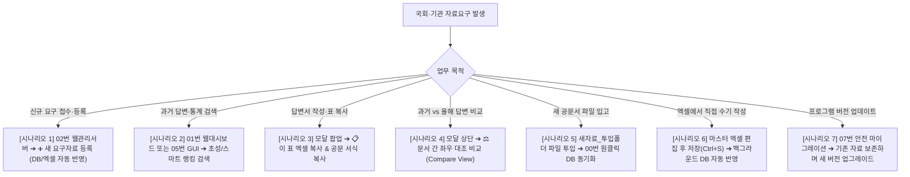

# 🛡️ 국회·기관 자료요구 스마트 관리 및 통합 검색 시스템
> **공문서(HWP/PDF) 답변 전문 & 관리대장 엑셀 실시간 양방향 연동 협업 플랫폼**

본 시스템은 공공기관 및 기업·부서에서 매년 수백 건씩 접수되는 **국회 및 대외기관 자료요구 관리대장**과 **공문서·답변서 원본**을 단일 시스템으로 통합하여, **1초 만에 과거 답변과 통계표를 찾아보고 신규 요구자료를 실시간으로 등록·관리**할 수 있도록 구축된 고도화 솔루션입니다.

- **실시간 양방향 연동**: 웹 화면에서 등록·수정한 내역이 부서의 기존 마스터 엑셀 대장에 즉시 자동 반영되며, 엑셀에서 직접 수기 수정한 내용도 웹 화면으로 자동 동기화됩니다.
- **초고속 통합 검색**: 한글 초성 검색, 조사 자동 분리, 띄어쓰기 무시, 전문 동의어 자동 확장을 지원하여 0.1초 만에 과거 답변서와 통계표를 찾아냅니다.
- **100% 로컬 오프라인 구동**: 외부 클라우드 전송 없이 사용자 PC 내에서 안전하게 구동되며, 개인정보(주민등록번호, 전화번호 등)를 자동으로 비식별화합니다.
- **타 부서 손쉬운 확장**: 부서명 설정만으로 어떤 부서나 기관에서도 자체 자료를 적재하여 독립적인 검색·관리 시스템으로 즉시 도입할 수 있습니다.

---

## 🚀 빠른 실행 방식 선택 가이드

사용자의 업무 환경과 목적에 따라 가장 알맞은 실행 파일을 더블클릭하세요:

| 번호 | 실행 배치파일 | 권장 대상 및 용도 | 파이썬 필요 여부 | 주요 기능 및 특징 |
| :---: | :--- | :--- | :---: | :--- |
| ⭐ | **`02_웹관리서버_실행.bat`** | **[강력 추천]** 실시간 관리자, 취합 담당자 | **필요** (3.9+) | **웹 대시보드 + 신규 요구자료 실시간 등록/수정/삭제 + 마스터 엑셀 실시간 양방향 동기화** |
| ⚡ | **`01_웹대시보드_실행.bat`** | 일반 실무자, 빠른 답변 검색자 | **완전 무설치** (0.1초 실행) | 브라우저 단독 실행, 초성/전문 초고속 검색, Q&A 분할 열람, 통계표 원클릭 엑셀 복사 |
| 🖥️ | **`05_통합검색프로그램_실행.bat`** | 브라우저 창 대신 단독 프로그램을 선호하는 사용자 | **완전 무설치** (단일 exe) | 독립 데스크톱 창(`자료요구_통합검색.exe`), 트리뷰 검색, 본문 즉시 열람, 원본 파일 바로 열기 |
| 📊 | **`03_엑셀DB_열기.bat`** | 엑셀 피벗, 통계 필터링이 필요한 실무자 | 엑셀(Excel) 프로그램 | 5개 시트(대시보드, 전체 목록, Q&A 1:N 상세, 관리대장, 통계현황) 통합 엑셀 열람 |
| 📥 | **`00_새자료_추가_및_DB동기화.bat`** | 새 공문서나 대장을 시스템에 추가할 때 | **필요** (3.9+) | `새자료_투입폴더` 내 문서를 연도별로 자동 분류하고, SQLite/엑셀/웹 대시보드 일괄 갱신 |
| ⚙️ | **`04_부서명_간편설정.bat`** | 타 부서에 본 시스템을 처음 도입할 때 | 무관 (메모장 대체 가능) | 부서명, 기관명, 검색 키워드를 대화형으로 입력하여 부서 맞춤형 환경으로 즉시 세팅 |
| 🔄 | **`06_배포패키지_동기화.bat`** | 시스템 개선사항을 배포본에 일괄 반영할 때 | **필요** (3.9+) | 부서 전용 및 범용 배포본 패키지 100% 동기화 |
| 🛡️ | **`07_기존자료_안전마이그레이션.bat`** | 새 버전으로 교체한 기존 사용 부서 | **필요** (3.9+) | 이전 설치본의 변환 자료를 손실 없이 안전하게 병합하고 DB·대시보드 재구축 |

---

## 📦 배포 방식 안내: "웹 대시보드(HTML) 단 한 파일만 공유해도 충분합니다!"

본 시스템은 관리자가 DB 구축(00번 실행)을 완료한 뒤, 생성된 **`자료요구_통합검색_대시보드.html` 단 한 파일만 실무자들에게 배포해도 완벽하게 작동**합니다.

```
[관리자 PC]                              [일반 실무자 PC (전체 부서원)]
00번 배치로 DB 동기화 완료  ➔➔ [공유] ➔➔   자료요구_통합검색_대시보드.html (단 1개 파일)
(SQLite / 마스터 엑셀 관리)   (메신저/이메일)   ✨ 더블클릭 즉시 실행 (설치 0초, 완전 무설치)
```

### 💡 왜 HTML 한 파일만으로 충분한가요?
1. **완전 무설치 (Zero-Install)**: 파이썬, 데이터베이스 엔진, 뷰어 프로그램 설치가 전혀 필요 없습니다. Chrome, Edge, Whale 등 일반 웹 브라우저만 있으면 더블클릭 즉시 0.1초 만에 열립니다.
2. **모든 데이터와 기능 내장 (All-in-One)**: 수년 치 공문서 답변 전문, Q&A 분할 내용, 관리대장 목록, 초성/동의어 검색 엔진, 통계표 엑셀 복사 기능이 모두 **HTML 파일 하나에 완벽히 내장**되어 있습니다.
3. **100% 오프라인 작동**: 사내망, 폐쇄망, 인터넷이 차단된 환경에서도 완벽히 단독 구동되며 외부 통신이 전혀 발생하지 않습니다.
4. **실무 핵심 기능 100% 지원**:
   - 0.1초 초고속 초성/전문 검색
   - 공식 서식 및 글자 스타일 그대로 전문 열람
   - **`이 표 엑셀 복사`** 버튼으로 셀 병합·서식 유지 엑셀 붙여넣기
   - 과거 vs 올해 답변 좌우 대조 비교 (Compare View)

> **[역할 구분 요약]**
> - **관리자/취합 담당자 (`02_웹관리서버_실행.bat`)**: 신규 요구자료 실시간 등록·수정 및 마스터 엑셀 대장과의 실시간 양방향 동기화를 수행하는 관리자 PC에서 실행합니다.
> - **일반 실무자 (`자료요구_통합검색_대시보드.html` 단독 전달)**: 신규 자료 등록이 필요 없고 과거 답변 조회, 서식 복사, 통계표 인용이 목적인 대다수 실무자에게는 이 HTML 파일 하나만 전달하면 끝납니다.

---

## 📖 실무 상황별 7대 핵심 사용 시나리오



---

### [시나리오 1] 새로운 요구자료가 접수되었을 때 (신규 등록 및 실시간 자동연계)

1. **`02_웹관리서버_실행.bat`**을 더블클릭하여 웹 관리 대시보드를 엽니다.
2. 대시보드 우측 상단의 **`＋ 요구자료 등록`** 버튼을 클릭합니다.
3. 팝업창에서 요구 정보를 입력합니다:
   - **의원명/요구자**, **요구자료 제목**(필수 입력), **세부 요구내역**, **요구일·제출 마감일**, **진행 상태**, **담당 부서** 등
   - 제목이나 세부 요구내역을 입력하면 **과거 유사 요구에 제출했던 답변**을 하단에 실시간으로 추천해 줍니다.
4. **`등록하기`** 버튼을 누르면 창이 닫히며 등록이 완료됩니다:
   - **SQLite DB 즉시 기록**: 브라우저 화면에 새 요구자료가 즉시 추가됩니다.
   - **마스터 엑셀(`.xlsm` / `.xlsx`) 자동 행 추가**: 기존 마스터 엑셀 대장의 해당 연도 시트에 새 행이 자동 기재됩니다. (해당 연도 시트가 없으면 기본 서식을 복제해 새 시트를 자동 생성합니다.)
   - **고유 `대장ID` 자동 부여**: 각 항목마다 고유 ID(예: `REQ-2026-001`)가 부여되어 엑셀에서 행을 정렬하거나 필터링해도 데이터가 섞이지 않습니다.
   - **스마트 자동연계 (Auto-Link)**: 기존 공문서 DB와 대조하여 연관된 과거 답변서가 있을 경우 자동으로 연결해 줍니다.
5. 제출을 마친 자료는 상세 모달에서 **`✓ 제출 완료로 표시`** 버튼 한 번으로 상태를 간편하게 갱신할 수 있습니다.

> [!TIP]
> **엑셀 파일이 열려 있을 때의 안전 보류**  
> 담당자가 엑셀 대장을 열어 편집 중일 때 웹에서 등록·수정하더라도 작업이 유실되지 않습니다. 시스템이 안전 보류 큐에 작업을 보관했다가, 엑셀이 닫히거나 저장되는 시점에 자동으로 안전하게 반영합니다.

---

### [시나리오 2] 과거 답변 및 유사 질의를 1초 만에 찾고 싶을 때 (스마트 검색)

1. **`01_웹대시보드_실행.bat`** 또는 **`02_웹관리서버_실행.bat`**을 실행합니다.
2. 상단 검색창에 키워드를 입력합니다:
   - **초성 검색**: `ㅇㅅㅇ` (예산안), `ㅈㄹㅇㄱ` (자료요구), `ㅅㅈㅇㄱ` (시정요구)
   - **완성형 + 초성 혼합**: `예ㅅㅇ`, `자ㄹ요구`, `시ㅈ요구`
   - **띄어쓰기 무시**: `정보보안망` ↔ `정보 보안망`, `자료요구` ↔ `자료 요구`
   - **조사 자동 분리**: `보고서를` 입력 시 자동으로 `보고서` 검색
   - **전문 동의어 자동 확장**: 기관 약칭이나 전문 용어 검색 시 정식 명칭 관련 자료까지 자동 매칭 (예: 사전 기반 교차 탐색)
   - **고급 연산자**: `"최근 3년"` (정밀 구문 검색), `예산 OR 결산`, `자료요구 -비공개` (제외 검색)
3. **4개 탭**을 통해 목적에 맞게 결과를 확인합니다:
   - **답변서**: 제출했던 답변서를 문서 단위로 열람
   - **질문·답변**: 답변서 내 개별 질문과 답변을 1:1로 분할 열람
   - **표 있는 답변서**: 통계표가 포함된 답변서만 모아 열람
   - **요구자료 관리대장**: 요구자료의 마감일정 및 제출 상태 관리
4. 화면 상단의 **제출 현황 배지**(`마감 지남`, `7일 안에 마감`, `아직 미제출`)를 누르면 마감이 임박하거나 지난 요구자료만 급한 순서로 즉시 모아볼 수 있습니다.

#### 화면 주요 용어 안내

| 화면에 보이는 말 | 설명 및 기존 용어 대응 |
|---|---|
| **답변서** | 문서 단위 검색 결과 |
| **질문·답변** | 답변서 내 개별 질문·답변 상세 검색 (1:N 분할) |
| **표 있는 답변서** | 통계표·서식표가 포함된 문서만 모아보기 |
| **마감 지남 · 7일 안에 마감 · 아직 미제출** | 관리대장 마감 현황 필터 (기한 경과, 임박, 미제출) |
| **새 문서 반영** | 00번 일괄 파이프라인 동기화 실행 |
| **보기 전용 (서버 꺼짐)** | 01번 무설치 HTML 단독 실행 상태 (`file://`) |
| **바뀐 기록** | 해당 항목의 변경 이력 내역 |
| **비슷한 말도 함께 찾기** | 유사어 및 동의어 자동 확장 검색 |

---

### [시나리오 3] 답변서 작성 시 과거 표 서식이나 문구를 복사할 때 (원클릭 서식 복사)

1. 검색 결과에서 원하는 문서 카드를 클릭하여 **상세 모달 팝업**을 엽니다.
2. **모달 상단 뷰 전환**:
   - **답변 전문 및 서식 표**: 공식 서식, 글자 스타일, 표 형태가 완벽히 재현된 원문 뷰
   - **텍스트 전문**: 복사하기 쉬운 깔끔한 순수 텍스트 뷰
   - **세부 Q&A 분할**: 질의문과 답변문이 1:1로 매칭된 분할 뷰
3. **원클릭 복사 활용**:
   - **`📋 이 표 엑셀 복사`**: 표 우측 상단 버튼을 클릭한 뒤 엑셀에 `Ctrl+V` 하면 **셀 병합, 테두리, 배경색이 완벽히 유지**된 채 엑셀 시트에 즉시 붙여넣어집니다.
   - **`📋 세부내역 복사`**: 공문서 표준 서식 규격(질의문 + 답변문)에 맞게 정돈된 텍스트가 클립보드에 복사됩니다.
   - **`📁 원본 파일 열기`**: 내 PC에 저장된 원본 HWP/PDF 파일을 기본 프로그램으로 즉시 실행합니다.

---

### [시나리오 4] 과거 답변과 올해 답변의 수치를 비교하고 싶을 때 (좌우 대조 비교)

1. 특정 문서의 상세 모달 창을 엽니다.
2. 모달 상단의 **`⚖️ 다른 문서와 좌우 비교`** 버튼을 클릭합니다.
3. 드롭다운에서 비교할 상대 문서(예: 작년 동일 의원실 요구자료 또는 유사 주제 문서)를 선택합니다.
4. **좌우 2단 분할 뷰(Side-by-Side)**에서 연도별 통계 수치 변화, 과거와 현재의 답변 기조 차이를 한눈에 대조할 수 있습니다.

---

### [시나리오 5] 새로운 공문서가 입고되었을 때 (원클릭 증분 적재)

1. 신규 공문서(HWP, HWPX, PDF, XLSX)를 **`새자료_투입폴더`**에 넣습니다.
   - *파일명이나 상위 폴더명에 포함된 연도를 자동 인식하므로 연도별 폴더째 넣어도 무방합니다.*
   - *작업 중 한글이나 엑셀에서 열어 둔 파일은 건너뛰고 나머지 파일 먼저 안전하게 처리됩니다.*
2. **`00_새자료_추가_및_DB동기화.bat`**을 더블클릭합니다.
3. **자동 처리 진행**:
   - **연도별 자동 분류**: 파일들을 해당 연도 폴더(`2026/` 등)로 자동 이동 및 정리
   - **초고속 병렬 파싱**: AI 기반 문서 분석 엔진이 표와 서식을 마크다운으로 초고속 변환 (기존 변환된 파일은 해시 캐시를 통해 즉시 스킵)
   - **개인정보 자동 마스킹**: 주민번호, 휴대전화번호 등 개인정보 자동 비식별화
   - **산출물 일괄 자동 갱신**: SQLite DB, 엑셀 통합 DB, 무설치 웹 대시보드(`자료요구_통합검색_대시보드.html`)가 모두 최신 데이터로 동기화 완료됩니다.

---

### [시나리오 6] 엑셀에서 직접 대장을 수기 작성/수정하고 싶을 때 (실시간 양방향 감시)

1. 평소 사용하시던 부서 마스터 엑셀 대장 파일(`*.xlsm` / `*.xlsx`)을 엽니다.
2. 새 행을 추가하거나 기존 내용을 수정한 뒤 **저장(`Ctrl+S`)**합니다.
3. **실시간 양방향 동기화**:
   - 백그라운드 감시 엔진이 파일 수정을 감지하여 3~5초 이내에 변경사항을 SQLite DB로 자동 반영합니다.
   - 웹 브라우저 창으로 마우스를 가져가면 화면이 새로고침 없이 **최신 데이터로 자동 갱신**됩니다.
   - 엑셀의 특정 칸만 수정한 경우 웹에서 기존에 입력했던 다른 칸의 데이터는 그대로 보존됩니다.

---

### [시나리오 7] 새 버전으로 프로그램을 교체할 때 (안전 마이그레이션)

1. 기존 프로그램 폴더를 삭제하지 말고, 새 버전 압축을 별도 폴더에 풉니다.
2. 새 폴더의 **`07_기존자료_안전마이그레이션.bat`**을 더블클릭하고, 열리는 창에서 이전 프로그램 폴더를 선택합니다.
3. 기존에 변환 완료된 마크다운 자료를 안전하게 새 폴더로 병합하고, 새 버전의 DB·엑셀·웹 대시보드를 일괄 재구축합니다.
   - *이전 폴더의 원본 파일과 대장 파일은 절대 훼손되거나 삭제되지 않습니다.*

---

## 🔍 스마트 검색 엔진 상세 문법 및 필드 한정 검색

대시보드(01번/02번)와 데스크톱 프로그램(05번) 모두 동일한 고성능 검색 엔진을 공유합니다.

### 1. 주요 검색 연산자

| 검색 유형 | 입력 예시 | 매칭 방식 및 효과 |
|:---|:---|:---|
| **초성 검색** | `ㅇㅅㅇ`, `ㅈㄹㅇㄱ` | 자음 초성만으로 `예산안`, `자료요구` 등 즉각 매칭 |
| **혼합 검색** | `예ㅅㅇ`, `자ㄹ요구` | 완성형 글자와 초성이 섞여도 정확히 인식 |
| **공백 무시** | `정보보안망`, `정보 보안망` | 띄어쓰기 여부와 상관없이 본문 일치 탐색 |
| **조사 자동 분리** | `보고서를`, `시스템에서` | 조사(`을/를/의/에/에서/으로/과/와` 등)를 자동 제거 후 어간으로 검색 |
| **정밀 구문 검색** | `"최근 3년"`, `"시정요구 내역"` | 큰따옴표 안의 문구를 어순과 공백 그대로 검색 |
| **OR (합집합)** | `예산 OR 결산` | 두 단어 중 하나라도 포함된 문서 검색 |
| **NOT (제외어)** | `자료요구 -비공개` | `자료요구`는 포함하되 `비공개`가 포함된 문서는 제외 |
| **전문 동의어** | `과기부` ↔ `과학기술정보통신부` | 내장된 전문 동의어 사전을 통해 약어·정식명칭 교차 탐색 |

### 2. 필드 한정 검색

검색창에 콜론(`:`) 문법을 입력하면 특정 조건을 걸어 정밀하게 찾을 수 있습니다:

| 문법 | 대상 필드 | 일치 방식 및 예시 |
|---|---|---|
| `요구자:홍길동` | 요구자(의원)명 | 부분 일치 ("홍길동 의원" 매칭) |
| `상태:제출` | 진행 상태 | 완전 일치 (`미제출` 제외) |
| `연도:2026` | 연도 | 해당 연도 자료만 검색 |
| `기간:2026-01-01..2026-06-30` | 요구일 범위 | 특정 기간 검색 (`기간:2026` 형태도 가능) |
| `문서번호:831` / `연번:17` | 문서/연번 | 번호 완전 일치 |
| `부서:기획팀` / `기관:국회` | 소관 부서/기관 | 부분 일치 |

> **검색 조합 예시**: `예산안 요구자:홍길동 기간:2026-01-01..06-30 -비공개`

---

## 📄 문서 전문 보존 및 대용량 검색 모드

웹 대시보드는 오프라인 환경에서도 **답변 전문과 표 서식이 끝까지 완벽하게 표시**되도록 설계되어 있습니다.

- **원문 100% 보존**: 상세 모달, 인쇄, 좌우 비교 시 텍스트가 임의로 잘리거나 생략되지 않고 원문 전체가 제공됩니다.
- **초고속 첫 화면 로딩**: 문서 수가 수천 건 이상으로 방대해져도 목록 정보가 0.1초 만에 먼저 뜨며, 문서 전문은 백그라운드에서 끊김 없이 부드럽게 적재됩니다.
- **타이핑 지연 없는 점진적 검색**: 수만 건의 방대한 문서 속에서도 입력창이 멈추지 않고 매끄럽게 실시간 검색이 진행됩니다.

---

## 🏢 타 부서 3분 맞춤 설정 및 범용 배포 가이드

다른 부서(예: 기획예산팀, 정책지원국 등)에서 본 시스템을 자체 부서 전용으로 활용하고자 할 때의 절차입니다:

```
[1단계: 부서 설정]          [2단계: 자료 투입]               [3단계: 원클릭 구축]
04_부서명_간편설정.bat   ➔   새자료_투입폴더 에 문서/대장 투입   ➔   00_새자료_추가_및_DB동기화.bat
(부서명·키워드 입력)         (HWP, PDF, 엑셀 대장)              (독립 DB·대시보드 자동 생성)
```

1. **`04_부서명_간편설정.bat` 실행**:
   - 콘솔 창에서 부서명(예: `기획예산팀`)과 시스템 명칭을 대화형으로 입력합니다. (파이썬이 없는 PC에서는 `config.json`이 메모장으로 열리며 직접 부서명을 수정할 수 있습니다.)
2. **부서 자료 투입**:
   - 부서의 공문서(HWP/PDF)나 관리대장 엑셀을 `새자료_투입폴더`에 넣습니다. (대장 양식이 없는 경우 제공되는 `(양식)국회_요구자료_목록_대장_템플릿.xlsx` 활용)
3. **`00_새자료_추가_및_DB동기화.bat` 실행**:
   - 투입된 자료를 분석하여 부서 전용 SQLite DB, 5개 시트 통합 엑셀 DB, 무설치 웹 대시보드가 자동으로 구축됩니다.
4. **타 부서 전달용 클린 패키지 생성**:
   - 생성된 범용 배포 폴더를 압축하여 타 부서에 전달하면 즉시 자체 시스템으로 운용할 수 있습니다.

---

## 📄 KorDoc을 활용한 공문서(HWP/HWPX/PDF) 파싱 및 시스템 연동 가이드

본 시스템의 자동 문서 변환 엔진은 공공기관 표준 문서 포맷인 **HWP, HWPX, PDF(스캔본 OCR 포함), XLSX, DOCX**를 서식과 다중 병합 표까지 완벽하게 Markdown(`.md`)으로 초고속 변환해주는 **[KorDoc](https://github.com/chrisryugj/kordoc)**과 유기적으로 연동됩니다.

### 1. KorDoc 소개 및 공식 다운로드

* **공식 GitHub 저장소**: [https://github.com/chrisryugj/kordoc](https://github.com/chrisryugj/kordoc)
* **공식 릴리스 및 다운로드**: [KorDoc Releases (GitHub)](https://github.com/chrisryugj/kordoc/releases)
* **주요 특징**:
  - HWP (한글 3.0/5.0), HWPX, PDF(한국어 OCR 지원), Office 문서를 깨짐 없이 고품질 마크다운으로 변환
  - 한국 공공기관 특유의 복잡한 다중 병합 셀, 신구조문대비표, 글상자 구조 완벽 복원
  - CLI 명령어 및 AI 에이전트 연동용 **MCP(Model Context Protocol)** 지원

### 2. KorDoc 설치 방법 (Windows 기준)

사용 환경에 따라 다음 두 가지 방식 중 하나로 간편하게 설치할 수 있습니다:

#### [방법 A] Windows 전용 인스톨러 (MSI) 설치 (권장 ⭐)
1. [KorDoc Releases](https://github.com/chrisryugj/kordoc/releases) 페이지에서 최신 **`KorDoc.AI_x64_ko-KR.msi`** 파일을 다운로드합니다.
2. 다운로드한 `.msi` 파일을 실행하여 마법사 안내에 따라 설치를 완료합니다. (약 20초 소요)
3. 설치가 완료되면 데스크톱 프로그램과 함께 명령 프롬프트(CMD) 및 PowerShell 환경변수(`PATH`)에 `kordoc` 명령어가 자동으로 등록됩니다.

#### [방법 B] npm 패키지 매니저로 전역 설치
Node.js(v18 이상)가 설치된 환경에서는 터미널에서 다음 명령어로 즉시 전역 설치할 수 있습니다:
```bash
npm install -g kordoc pdfjs-dist
```

> **설치 확인**: 터미널(CMD 또는 PowerShell)에서 `kordoc --version`을 입력하여 정상 출력되는지 확인합니다.

### 3. 파싱 후 본 시스템 연동하기 (3가지 방식)

#### 🚀 방식 1: 원클릭 자동 파싱 및 DB 연동 (가장 추천)
KorDoc이 설치되어 있으면, 본 시스템이 `kordoc` CLI를 자동으로 감지하여 모든 과정을 원클릭으로 처리합니다:
1. 부서의 HWP, HWPX, PDF 답변서 원본들을 **`새자료_투입폴더/`**에 넣습니다. (연도별 하위 폴더가 있어도 자동 인식)
2. **`00_새자료_추가_및_DB동기화.bat`**를 더블클릭합니다.
3. 시스템 내부 파이프라인(`scripts/parse_all.py`)이 KorDoc을 병렬 호출하여 문서를 마크다운으로 초고속 변환(`_parsed_markdown/` 폴더에 저장)하고, SQLite DB 색인, Q&A 분할, 엑셀 통합 DB, 단일 HTML 대시보드 갱신까지 전자동으로 완료합니다.

#### 💻 방식 2: KorDoc CLI 명령어로 직접 변환 후 연동
터미널에서 개별 문서를 직접 변환하여 적재할 수도 있습니다:
```bash
# 기본 한글 문서 변환
kordoc "입력문서.hwp" -o "_parsed_markdown/2026/입력문서.hwp.md"

# 스캔된 이미지 PDF 문서 한국어 OCR 변환
kordoc "스캔답변.pdf" --ocr -o "_parsed_markdown/2026/스캔답변.pdf.md"
```
변환된 `.md` 파일을 `_parsed_markdown/<연도>/` 폴더에 저장한 뒤 `00_새자료_추가_및_DB동기화.bat`를 실행하면 즉시 검색 DB에 색인됩니다.

#### 🤖 방식 3: Claude Desktop / Cursor / Antigravity AI 에이전트(MCP) 연동
AI 코딩 도구나 어시스턴트에서 직접 문서를 열람하고 파싱하도록 설정할 수 있습니다:
* **Claude Desktop 설정** (`%APPDATA%\Claude\claude_desktop_config.json`):
```json
{
  "mcpServers": {
    "kordoc": {
      "command": "kordoc",
      "args": ["mcp"]
    }
  }
}
```
* AI 에이전트에게 *"새자료_투입폴더의 문서를 kordoc parse_document로 파싱해서 _parsed_markdown에 넣어줘"* 라고 요청하여 지능형 파싱 작업을 수행할 수 있습니다.

> 📖 **더 자세한 안내**: 보다 상세한 옵션과 예시는 저장소 내 [`kordoc_파싱_및_설치_가이드.md`](kordoc_%ED%8C%8C%EC%8B%B1_%EB%B0%8F_%EC%84%A4%EC%B9%98_%EA%B0%80%EC%9D%B4%EB%93%9C.md) 문서를 참고하세요.

---

## 📁 핵심 폴더 및 파일 구조

```
📁 국회자료요구_스마트시스템/
│
├── 🚀 실행 배치파일 (Launchers)
│   ├── 00_새자료_추가_및_DB동기화.bat    # 새 문서 투입 시 자동분류 및 DB 일괄 동기화
│   ├── 01_웹대시보드_실행.bat            # 완전 무설치 독립형 브라우저 대시보드 바로 실행
│   ├── 02_웹관리서버_실행.bat            # [강력 추천 ⭐] 실시간 관리 및 엑셀 양방향 동기화 서버
│   ├── 03_엑셀DB_열기.bat                # 5개 시트 고급 엑셀 통합 DB 즉시 실행
│   ├── 04_부서명_간편설정.bat            # 타 부서 적용 시 부서명 원클릭 설정
│   ├── 05_통합검색프로그램_실행.bat      # 독립형 GUI 데스크톱 프로그램 구동 (단일 exe)
│   ├── 06_배포패키지_동기화.bat          # 원본 개선사항을 배포본에 일괄 동기화
│   └── 07_기존자료_안전마이그레이션.bat  # 이전 버전 자료를 안전하게 병합·업그레이드
│
├── 📁 새자료_투입폴더/                   # 신규 공문서(HWP/PDF) 및 대장 투입용 폴더
├── 📁 _parsed_markdown/                  # 문서 분석 마크다운 저장소 (연도별 자동 관리)
├── 📄 자료요구_통합검색_대시보드.html     # 오프라인 단독 구동 가능한 실시간 검색 웹 대시보드
├── 📊 국회_자료요구_통합DB.xlsx          # 5개 시트 엑셀 통합 데이터베이스
├── 💾 data_requests.db                   # 고성능 Trigram FTS5 검색 엔진이 적용된 SQLite DB
├── ⚙️ config.json                         # 부서명, 기관명, 검색 키워드 설정 파일
└── 📋 requirements.txt                   # 파이썬 의존성 패키지 (openpyxl)
```

---

## 🛡️ 데이터 무결성 및 시스템 안전장치

본 시스템은 공공기관의 실제 대장 데이터가 실수나 충돌로 인해 유실되지 않도록 엄격한 보호 장치를 갖추고 있습니다.

### 1. 저장소별 정본(Source of Truth) 원칙

| 데이터 | 정본 위치 | 관리 원칙 |
| :--- | :--- | :--- |
| **공문서 본문·Q&A** | `_parsed_markdown/` → SQLite | 원문 마크다운을 기반으로 안전하게 구축·보존 |
| **관리대장 레코드** | SQLite (`request_ledger`) | 웹 등록·수정·삭제가 실시간 기록되는 기준 |
| **관리대장 필드 값** | 마스터 엑셀 대장 | 엑셀에서 수기 편집한 내용이 다음 동기화 시 DB에 자동 반영 |
| **관리대장 식별자** | 엑셀의 `대장ID` 열 | 행마다 고유 ID가 부여되어 정렬·필터링 시에도 항목 혼선 방지 |
| **검색용 캐시 산출물** | HTML / JSON / 통합 XLSX | SQLite DB를 기반으로 생성되는 조회용 캐시 |

### 2. 마스터 엑셀 자동 백업 및 복구
- 웹에서 대장을 등록·수정할 때마다 `.ledger_backup/` 폴더에 마스터 엑셀 사본을 자동으로 보관합니다 (최근 5본 롤링 백업 및 14일치 일별 백업).
- 원본 파일을 직접 덮어쓰지 않고 임시 파일 검증 후 원자적으로 교체하므로 저장 도중 전원이 꺼져도 엑셀이 깨지지 않습니다.

### 3. 동시 실행 및 편집 충돌 방지
- **웹 서버 단일 인스턴스**: 02번 웹 관리 서버는 중복 실행되지 않으며, 이미 켜져 있는 경우 기존 창을 안내합니다.
- **동시 수정 보호**: 여러 사용자가 동시에 같은 항목을 수정할 경우, 나중에 저장한 사용자의 내용으로 무조건 덮어쓰지 않고 변경 충돌을 안내합니다.

### 4. 문서 변환 안전장치
- 문서 일부에 손상이 있어 변환에 실패하더라도, 전체 처리를 중단하지 않고 **정상적인 나머지 문서들로 DB 및 대시보드 갱신을 끝까지 완료**합니다.
- 실수로 원문이 대량 삭제되는 사고를 방지하기 위해, 기존 문서 수 대비 급격한 감소가 감지되면 자동으로 DB 교체를 멈춥니다. (실제 문서를 정리한 경우 `python scripts/extract_and_build_db.py --allow-shrink` 옵션으로 반영 가능)

---

## 🔌 시스템 연계 및 REST API 명세 (개발자 및 시스템 연계용)

`02_웹관리서버_실행.bat` 구동 시 로컬 포트(`http://127.0.0.1:8080`)를 통해 외부 스크립트나 시스템과 연계할 수 있는 표준 REST API를 제공합니다:

| Method | Endpoint | 설명 및 기능 |
| :---: | :--- | :--- |
| `GET` | `/api/search` | 통합 전문 검색 (문서, Q&A, 관리대장) |
| `GET` | `/api/documents` | 공문서 목록 조회 및 전문 검색 |
| `GET` | `/api/qa` | 세부 질문-답변(1:N 분할) 검색 |
| `GET` | `/api/ledger` | 관리대장 목록 조회 (연도, 진행상태, 마감일 필터링) |
| `GET` | `/api/ledger/<id>` | 특정 요구자료 상세 조회 |
| `POST` | `/api/ledger` | 신규 요구자료 등록 (DB 기록 + 엑셀 자동 반영) |
| `PUT` | `/api/ledger/<id>` | 요구자료 수정 (DB + 엑셀 동시 반영) |
| `DELETE`| `/api/ledger/<id>` | 요구자료 삭제 |
| `GET` | `/api/suggest` | 요구자·정당·기관·부서 자동완성 제안 |
| `GET` | `/api/sync` | 엑셀 동기화 및 백그라운드 파이프라인 상태 확인 |
| `POST` | `/api/sync/excel` | 마스터 엑셀 → DB 수동 동기화 요청 |
| `GET` | `/api/file` | 원본 문서 파일 및 마크다운 안전 서빙 |

---

## 🔒 보안 및 개인정보 보호 정책

1. **100% 로컬 오프라인 구동**: 모든 데이터 처리는 외부 인터넷이나 클라우드로 전송되지 않으며, 사용자 로컬 PC(`127.0.0.1`) 내부에서만 완결됩니다. 원격 외부 이미지 요청도 브라우저에서 차단됩니다.
2. **개인정보(PII) 자동 마스킹**: 주민등록번호, 휴대전화번호, 이메일 주소 등 민감 정보는 문서 파싱 시뿐만 아니라 웹 대장 등록·수정 시에도 정규식 엔진에 의해 자동으로 비식별화 처리됩니다.
3. **데이터 격리 보호 (`.gitignore`)**: 실제 공문서 원문, 엑셀 대장, SQLite 데이터베이스 파일은 Git 추적에서 원천 배제되어 저장소에 소스코드 외 민감 데이터가 유출되지 않습니다.

---

## 📜 라이선스 (License)

이 프로젝트는 [MIT License](LICENSE)에 따라 자유롭게 사용, 수정, 배포할 수 있습니다.
